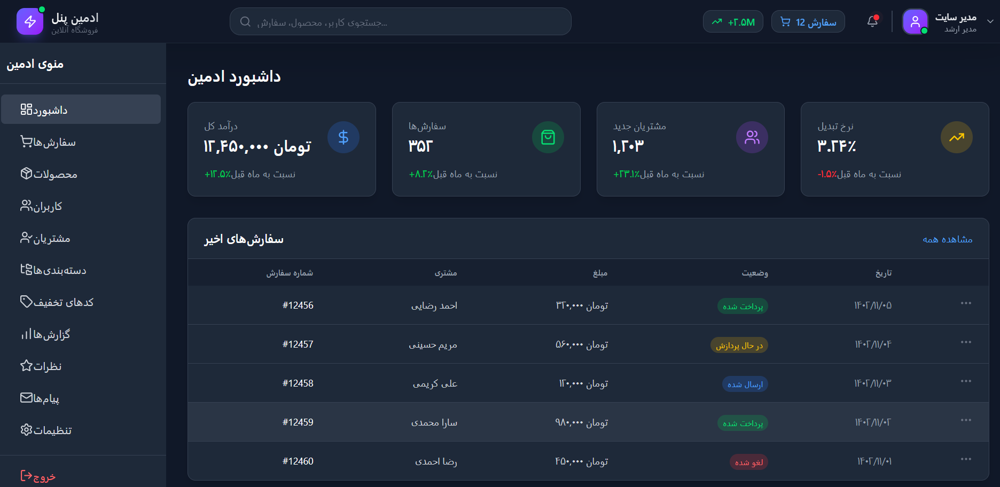
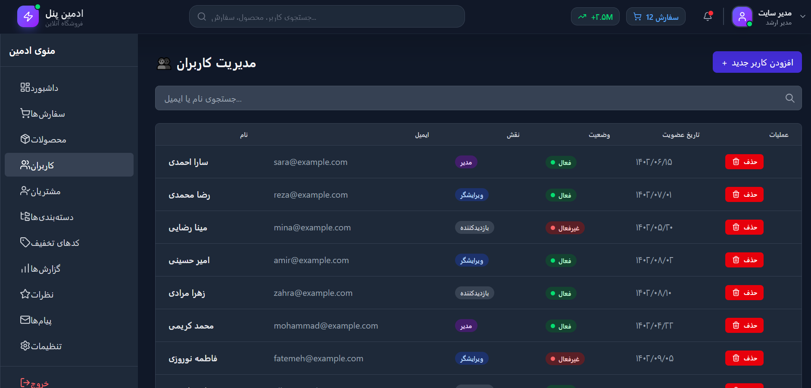
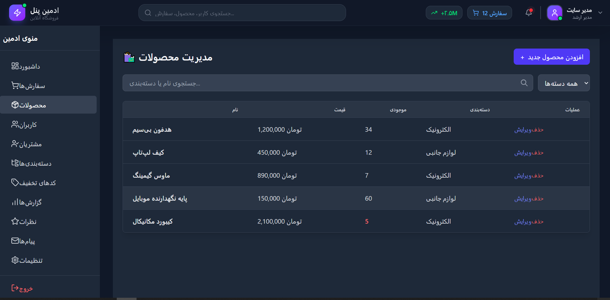
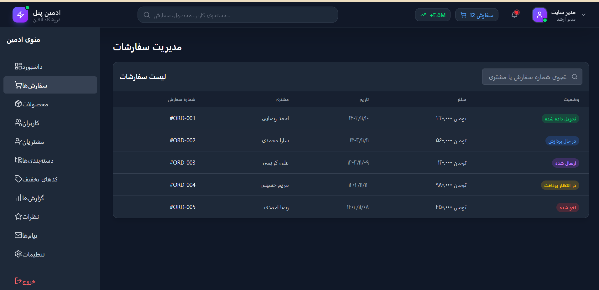

<div dir="rtl">
🛒# 🛒 داشبورد مدیریت فروشگاه

یک پنل ادمین مدرن و واکنش‌گرا برای مدیریت فروشگاه اینترنتی، ساخته‌شده با **React**، **TypeScript** و **Tailwind CSS**.

---

## 🖼️ پیش‌نمایش (Screenshots)

<div align="center">
  
  
  
  
</div>

> 💡 می‌توانید تصاویر واقعی پروژه را در پوشه‌ی `screenshots/` قرار دهید و مسیرها را جایگزین کنید.

---

## 🌐 لینک نمایش زنده (Live Demo)

🔗 [مشاهده نسخه آنلاین](https://admin-dash-react-ylvr.vercel.app/)

---

## ✨ امکانات

- **داشبورد اصلی** – آمار کلی فروش، سفارش‌های اخیر و نمودارهای فروش
- **مدیریت سفارش‌ها** – مشاهده، فیلتر و تغییر وضعیت سفارشات
- **مدیریت محصولات** – افزودن، ویرایش و حذف محصولات همراه با جستجو و فیلتر
- **مدیریت کاربران** – جدول کاربران با قابلیت جستجو و حذف
- **مدیریت مشتریان** – اطلاعات مشتریان، مجموع خرید و جزئیات
- **دسته‌بندی‌ها** – دسته‌بندی سلسله‌مراتبی (والد-فرزند) با قابلیت افزودن و ویرایش
- **کدهای تخفیف** – تعریف کدهای درصدی یا مبلغ ثابت با تاریخ انقضا و محدودیت استفاده
- **گزارش‌های فروش** – فروش روزانه، هفتگی و ماهانه، محصولات پرفروش و مقایسهٔ دوره‌ای
- **مدیریت نظرات** – تأیید/رد نظرات کاربران و پاسخ‌دهی
- **پیام‌ها** – صندوق پیام‌های دریافتی با امکان پاسخ
- **تنظیمات فروشگاه** – ویرایش نام، اطلاعات تماس، واحد پول و هزینهٔ ارسال
- **طراحی کاملاً واکنش‌گرا** – نمایش بهینه در موبایل، تبلت و دسکتاپ
- **تم تیره (Dark Mode)** یکپارچه در سراسر پنل

---

## 🛠️ تکنولوژی‌ها

| فناوری | کاربرد |
|--------|--------|
| React 18 (با TypeScript) | فریم‌ورک |
| Vite | ابزار ساخت |
| Tailwind CSS | استایل‌دهی |
| React Query (TanStack Query) | مدیریت state و سرور |
| Axios | درخواست‌های HTTP |
| React Router v6 | مسیریابی |
| Lucide React | آیکن‌ها |
| فایل JSON (`public/db.json`) | داده‌های محلی (قابل جایگزینی با API واقعی) |

---

## 📁 ساختار پوشه‌های اصلی
src/
├── api/ # تنظیمات Axios و React Query
├── components/ # کامپوننت‌های اشتراکی (Layout, Users, Categories, ...)
├── hooks/ # هوک‌های سفارشی (useUsers, useAuth, ...)
├── pages/ # صفحات برنامه
├── store/ # مدیریت state
├── styles/ # فایل‌های استایل اضافی
├── App.tsx # تنظیم مسیرها
└── main.tsx # نقطهٔ ورودی
public/
└── db.json # پایگاه دادهٔ محلی

text

---

## ⚡ راه‌اندازی پروژه

### ۱. پیش‌نیازها
- [Node.js](https://nodejs.org) نسخهٔ ۱۸ یا بالاتر
- npm (همراه Node.js نصب می‌شود)

### ۲. نصب و اجرا

```bash
# کلون کردن مخزن
git clone https://github.com/MobinDe/Admin-Dash-React.git
cd admin-dashboard

# نصب وابستگی‌ها
npm install

# اجرای پروژه در محیط توسعه
npm run dev
پس از اجرا، برنامه روی آدرس http://localhost:5173 در دسترس خواهد بود.

📊 داده‌های نمونه
پروژه از فایل public/db.json برای تأمین داده‌های اولیه استفاده می‌کند. برای اتصال به API واقعی، کافیست baseURL در axiosInstance.ts را تغییر دهید.

🤝 مشارکت
پیشنهادات، گزارش باگ‌ها و Pull Requestهای شما استقبال می‌شود.

📄 مجوز
این پروژه تحت مجوز MIT منتشر شده است.
